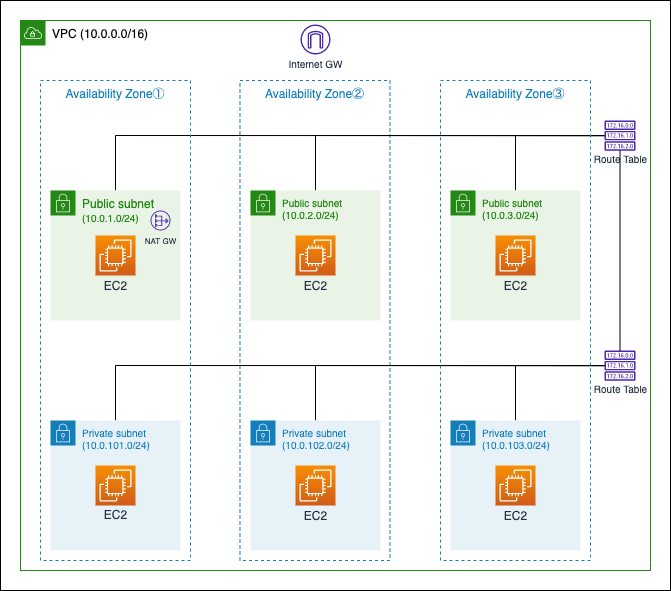

# AZ間のレイテンシ測定

## 概要
Terraformを使ってAWSのAZ間のレイテンシを測定するリソースを作成できます。  
**※以下の内容を実行することによって生じた一切の障害について当方はその責任を負いません**

## 構成図


## 前提
- [Terraform](https://learn.hashicorp.com/tutorials/terraform/install-cli)がインストール済みであること
- 適切な権限を付与したAWS Credentialを作成済みであること
    - 今回はテストのために"AmazonEC2FullAccess"、"AmazonVPCFullAccess"、"AmazonSSMReadOnlyAccess"を付与したAWS Credentialを作成しました
- AWS認証を行うための認証情報が設定済みであること([Terraform公式 ドキュメント
](https://registry.terraform.io/providers/hashicorp/aws/latest/docs))

## 使用方法

**注意点:**  
デフォルトでは全ての接続元(0.0.0.0/0)からSSH接続を許可します。  
秘密鍵がないとSSH接続は出来ませんが、セキュリティ的に`terraform apply`と`terraform destroy`を実行する際に以下の変数を追加して接続元IPを制限することを推奨します。  
> -var='allow_ssh_ip=`your_source_ip_adress_cidr`'

修正後`terraform apply`実行例:
> terraform apply -var='allow_ssh_ip=192.0.2.100/32'

### 東京リージョン(ap-northeast-1)
1. リソース作成  
以下コマンドを実行後に確認メッセージが出力されたら'yes'をタイプしてEnterを押下すると、数分程度でリソースが作成されます。
```sh
terraform init && terraform apply
```

出力例:

```sh
~~~~~~~~~~抜粋~~~~~~~~~~
Apply complete! Resources: 31 added, 0 changed, 0 destroyed.

Outputs:

instance_private_subnet_private_ips = {
  "apne1-az1" = [
    "10.0.101.172",
  ]
  "apne1-az2" = [
    "10.0.102.80",
  ]
  "apne1-az4" = [
    "10.0.103.240",
  ]
}
instance_public_subnet_private_ips = {
  "apne1-az1" = [
    "10.0.1.130",
  ]
  "apne1-az2" = [
    "10.0.2.248",
  ]
  "apne1-az4" = [
    "10.0.3.167",
  ]
}
instance_public_subnet_public_ips = {
  "apne1-az1" = [
    "192.0.2.100",
  ]
  "apne1-az2" = [
    "192.0.2.150",
  ]
  "apne1-az4" = [
    "192.0.2.200",
  ]
}
```

2. レイテンシ測定サーバにログイン  
以下コマンド`DESTINATION_INSTANCE_PUBLIC_IP`を`1.`で出力された"instance_public_subnet_public_ips"から測定元のAZ IDのIPアドレスと置き換えて実行する。
```sh
ssh -i AWS-Tokyo-Check-latency.pem ec2-user@DESTINATION_INSTANCE_PUBLIC_IP
```

3. レイテンシ測定  
以下コマンド例の`DESTINATION_IP1~3`を`1.`で出力された"instance_private_subnet_private_ips"へ置き変えて実行する。  

レイテンシ測定コマンド:
```sh
# Initialiging the array
ARRAY=()
# Add destination ip address to array(Execute the following command for the number of destinations you want to run the test.)
ARRAY=("${ARRAY[@]}" "DESTINATION_IP1") # Replace `destination_ip`(Example: ARRAY=("${ARRAY[@]}" "192.0.2.100"))
ARRAY=("${ARRAY[@]}" "DESTINATION_IP2")
ARRAY=("${ARRAY[@]}" "DESTINATION_IP3")
# netperf command exec loop
for IP in ${ARRAY[@]}; do
    echo "###########################  Destination: ${IP}  ###########################"
    netperf -H ${IP} -l 60 -t TCP_RR -w 10ms -v 2 -- -O min_latency,mean_latency,max_latency,stddev_latency,transaction_rate
    echo
done
```

実行例:
```sh
[ec2-user@ip-10-0-1-130 ~]$ ARRAY=()
[ec2-user@ip-10-0-1-130 ~]$ ARRAY=("${ARRAY[@]}" "10.0.101.172")
[ec2-user@ip-10-0-1-130 ~]$ ARRAY=("${ARRAY[@]}" "10.0.102.80")
[ec2-user@ip-10-0-1-130 ~]$ ARRAY=("${ARRAY[@]}" "10.0.103.240")
[ec2-user@ip-10-0-1-130 ~]$ for IP in ${ARRAY[@]}; do
>     echo "###########################  Destination: ${IP}  ###########################"
>     netperf -H ${IP} -l 60 -t TCP_RR -w 10ms -v 2 -- -O min_latency,mean_latency,max_latency,stddev_latency,transaction_rate
>     echo
> done
###########################  Destination: 10.0.101.172  ###########################
MIGRATED TCP REQUEST/RESPONSE TEST from 0.0.0.0 (0.0.0.0) port 0 AF_INET to 10.0.101.172 () port 0 AF_INET : spin interval : first burst 0
Minimum      Mean         Maximum      Stddev       Transaction 
Latency      Latency      Latency      Latency      Rate        
Microseconds Microseconds Microseconds Microseconds Tran/s      
                                                                
53           59.78        14164        15.17        16694.098   

###########################  Destination: 10.0.102.80  ###########################
MIGRATED TCP REQUEST/RESPONSE TEST from 0.0.0.0 (0.0.0.0) port 0 AF_INET to 10.0.102.80 () port 0 AF_INET : spin interval : first burst 0
Minimum      Mean         Maximum      Stddev       Transaction 
Latency      Latency      Latency      Latency      Rate        
Microseconds Microseconds Microseconds Microseconds Tran/s      
                                                                
963          976.14       1962         8.18         1024.302    

###########################  Destination: 10.0.103.240  ###########################
MIGRATED TCP REQUEST/RESPONSE TEST from 0.0.0.0 (0.0.0.0) port 0 AF_INET to 10.0.103.240 () port 0 AF_INET : spin interval : first burst 0
Minimum      Mean         Maximum      Stddev       Transaction 
Latency      Latency      Latency      Latency      Rate        
Microseconds Microseconds Microseconds Microseconds Tran/s      
                                                                
1498         1513.43      3050         9.82         660.672 
```

4. 測定サーバログアウト  
以下コマンドで測定サーバからログアウトする
```sh
exit
```

5. リソース削除  
以下コマンドを実行後に確認メッセージが出力されたら'yes'をタイプしてEnterを押下すると、数分程度でリソースが削除されます。
```sh
terraform destroy
```

出力例:
```sh
~~~~~~~~~~抜粋~~~~~~~~~~
Destroy complete! Resources: 31 destroyed.
```

### 大阪リージョン(ap-northeast-3)
大阪リージョンではリソース作成とリソース削除以外は[東京リージョン(ap-northeast-1)](#-東京リージョン(ap-northeast-1))の手順と同じです。

#### リソース作成
```sh
terraform init && terraform apply \
    -var='availability_zone_names=["apne3-az1", "apne3-az2", "apne3-az3"]' \
    -var='region=ap-northeast-3' \
    -var='region_name=Osaka'
```

#### リソース削除
```sh
terraform destroy \
    -var='availability_zone_names=["apne3-az1", "apne3-az2", "apne3-az3"]' \
    -var='region=ap-northeast-3' \
    -var='region_name=Osaka'
```

# 作成者
Yuki Tsumita ([Twitter](https://twitter.com/tsumita7))

# License
このリポジトリはMITライセンスです。詳しくは`LICENSE.txt`を参照してください。
